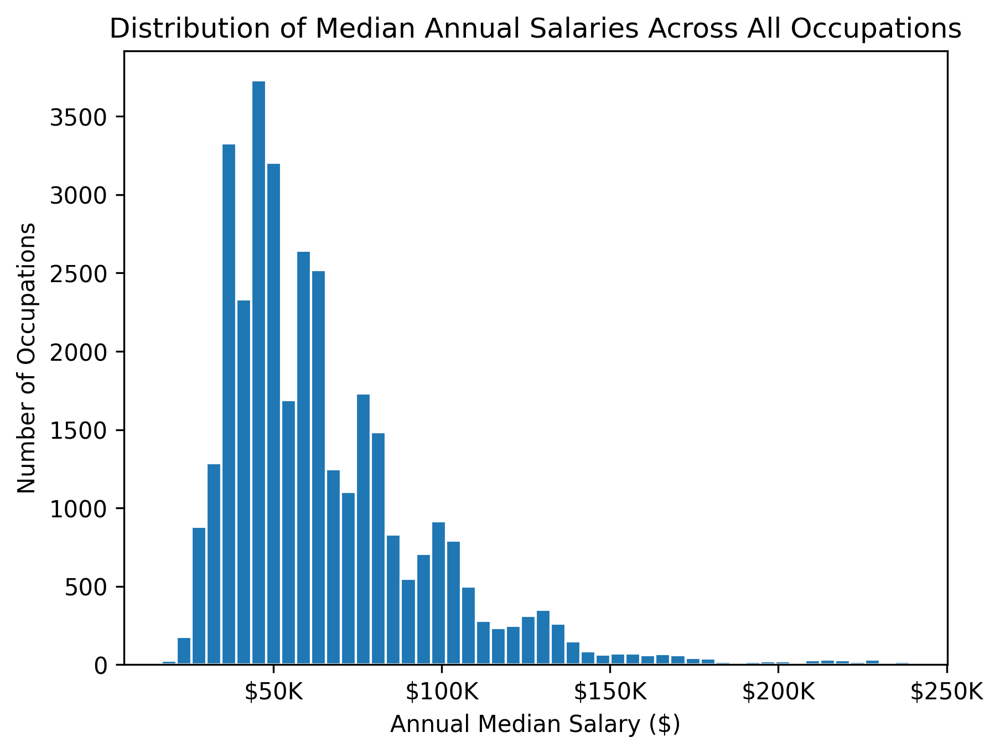
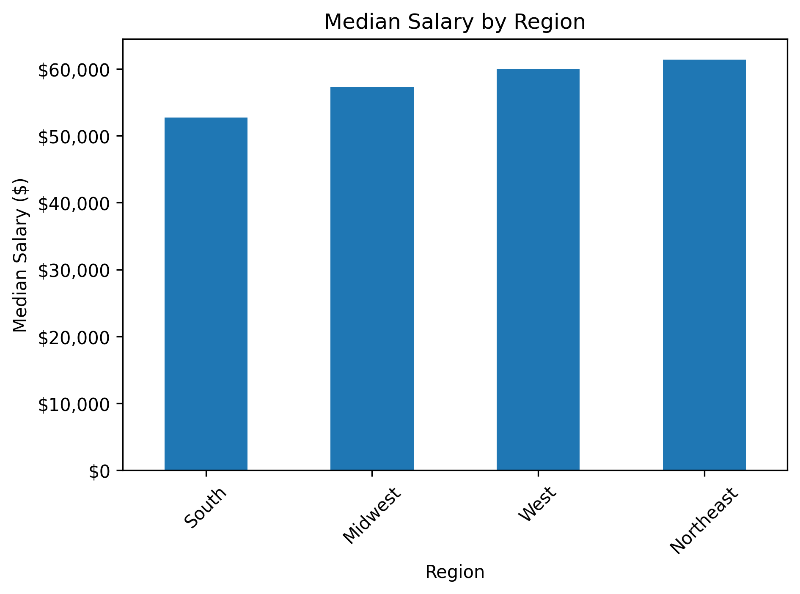
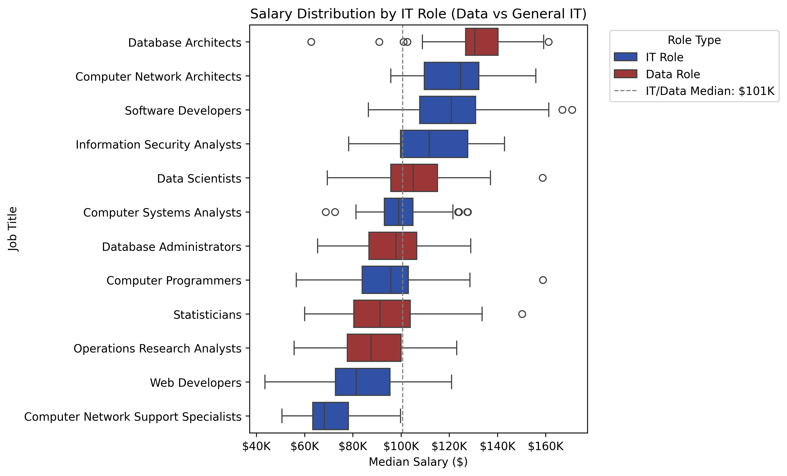
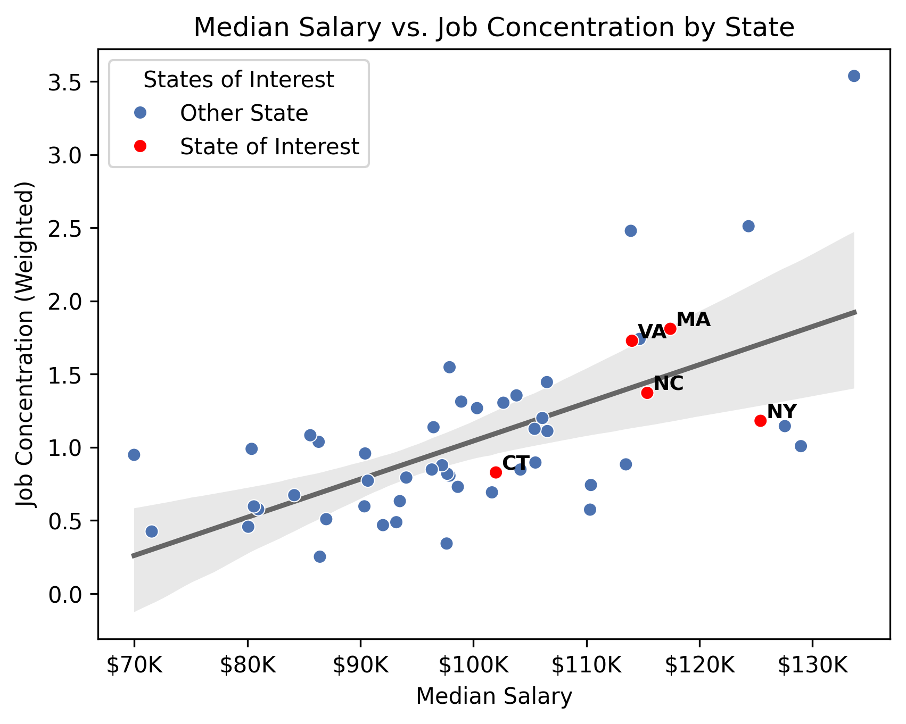

# U.S. Data & IT Job Market Analysis

## Project Overview

This project analyzes U.S. occupational employment and wage data to compare salary levels, job concentration, and geographic opportunities for data and IT-related roles. I built this project to better understand the job market I am entering as a Business-IT student interested in data analytics.

## Business Questions

1. What does the overall salary landscape look like across all occupations?
2. How do data roles compare to broader IT roles in terms of salary and distribution?
3. Among the states I am interested in working in, which ones offer the best combination of salary and job concentration for data roles?

## Data Source

The dataset comes from the U.S. Bureau of Labor Statistics Occupational Employment and Wage Statistics data. It includes occupational wage, employment, location, and job concentration information across U.S. states.

Link: https://www.bls.gov/oes/tables.htm

Dataset found as XLSX file next to 'State' under the May 2024 section.


## Tools Used

- Python
- Pandas
- Matplotlib
- Seaborn
- Jupyter Notebook

## Methods

- Cleaned and prepared occupational wage data
- Renamed columns for readability
- Converted salary, employment, and job concentration fields to numeric formats
- Created regional groupings for geographic analysis
- Classified selected occupations into data-specific and broader IT roles
- Calculated employment-weighted job concentration by state
- Built visualizations to compare salary distributions and geographic opportunity

## Visualizations

### Overall Salary Distribution


This histogram shows the overall distribution of median annual salaries across all occupations in the dataset. It provides an understanding of the larger U.S. job market before narrowing the analysis to IT and data roles.

### Regional Salary Comparison


This bar chart compares median salaries across U.S. regions to show broad geographic salary differences.

### IT and Data Role Salary Comparison



This boxplot compares salary distributions across selected IT and data-related roles. It highlights how data roles fit within the broader IT job market.

### Salary and Job Concentration Analysis


This scatterplot compares median salary and job concentration for data roles across states, helping identify states with stronger combinations of pay and opportunity.

## Key Findings

- Data roles are generally competitive within the broader IT job market.
- Database Architects and Data Scientists ranked near the top of the selected IT salary distribution.
- Salary alone does not fully explain job market opportunity; job concentration also matters.
- Among the highlighted states, North Carolina appeared to offer a strong combination of competitive salary and above-average job concentration.

## Skills Demonstrated

- Data cleaning and preprocessing
- Exploratory data analysis
- Feature engineering
- Weighted average calculations
- Data visualization
- Salary and labor market analysis
- Communicating insights from data

## What I Learned

This project helped me practice turning a large public dataset into a focused analysis. I strengthened my skills in cleaning messy data, grouping and merging datasets, and building visualizations that create useful insights. I learned that as a data analyst, you must ask the right questions, think outside the box, and think critically about what the data does not show.

## How to Run This Project

1. Clone the repository:

```bash
git clone https://github.com/connorbly7/US-Data-And-IT-Job-Market-Analysis.git
```
2. Download the original dataset from the U.S. Bureau of Labor Statistics Occupational Employment and Wage Statistics May 2024 data source. 

```
Link: https://www.bls.gov/oes/tables.htm
Dataset found as XLSX file next to 'State' under the May 2024 section.
```

3. Convert to CSV and place file into the project folder  

4. Open the Notebook:
```
data_it_job_market_analysis.ipynb
```
5. Install required Python libraries if needed:
```
pip install pandas matplotlib seaborn
```
6. Run notebook from top to bottom

## Files

- `data_it_job_market_analysis.ipynb` — full notebook analysis
- `cleaned_bls_oews_2024.csv` — cleaned dataset used for analysis
- `images/` — exported project visualizations
